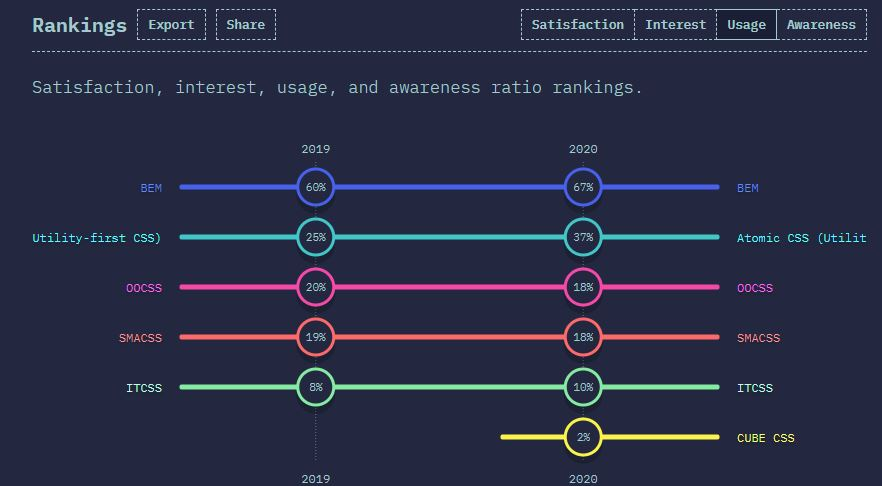

## Qué es BEM

Uno de los mayores quebraderos de cabeza de ser programador es, sin duda, poner nombre a las cosas. Por trivial que parezca, la nomenclatura es muy importante, sobre todo cuando se trabaja en equipo y en proyectos con una escala considerable. Existen varias metodologías para trabajar con CSS, pero si echamos un vistazo a la magnífica web de [stateofcss](https://2020.stateofcss.com/en-US/technologies/methodologies/), podemos ver como esta sigue siendo la más utilizada.

La metodología BEM aboga por el uso de una de nomenclatura de clases CSS simple y fácil de leer. Un lenguaje común que funciona (o al menos eso promete) tanto para proyectos pequeños como a gran escala. Si llevas tiempo trabajando con CSS, seguro que como mínimo has oído hablar de esta metodología, y si no es así, te recomiendo que sigas leyendo este artículo, puesto que te servirá de punto de partida.

BEM proviene de las siglas:

* **B**loque
* **E**lemento
* **M**odificador

###Bloque

###Elemento

###Modificador

###No es oro todo lo que brilla

###Conclusión