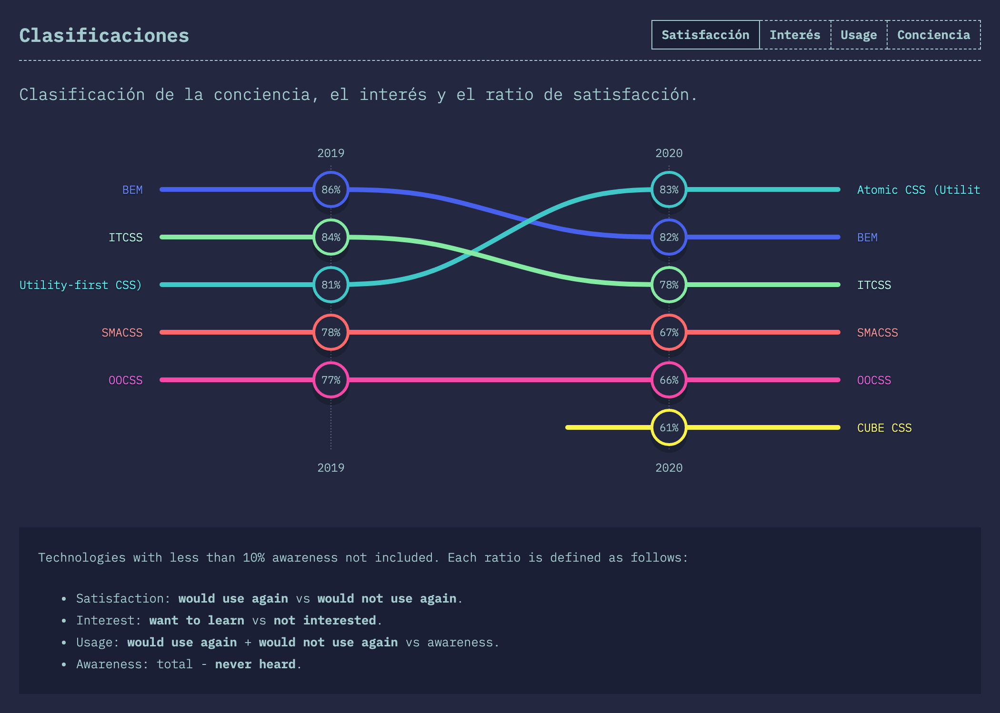

Uno de los mayores quebraderos de cabeza a la hora de escribir CSS puede ser, sin duda, poner nombre a tus clases. Por trivial que parezca, la nomenclatura es muy importante, sobre todo cuando se trabaja en equipo y en proyectos con una escala considerable. Existen varias metodologías para trabajar con CSS, pero si echamos un vistazo a la (muy recomendada) web de [stateofcss](https://2020.stateofcss.com/en-US/technologies/methodologies/), podemos ver como esta sigue siendo de las más conocidas y utilizadas.



## Qué es BEM

> "Block Element Modifier is a methodology that helps you to create reusable components and code sharing in front-end development" - getbem.com

La metodología BEM aboga por el uso de una de nomenclatura de clases CSS simple y fácil de leer. Un lenguaje común que funciona (o al menos eso promete) tanto para proyectos pequeños como a gran escala. Si llevas tiempo trabajando con CSS, seguro que como mínimo has oído hablar de esta metodología, y si no es así, te recomiendo que sigas leyendo este artículo, puesto que te servirá como punto de partida.

BEM proviene de las siglas:

* **B**loque
* **E**lemento
* **M**odificador

Y la nomenclatura que utiliza sigue el siguiente patrón:

`.block {}
.block__element {}
.block--modifier {}`

### Bloque

Un **bloque** hace referencia a una entidad o componente independiente que tiene sentido por sí solo, por ejemplo:  

`navbar`, `footer`, `post`, `button`, `alert`...

Los bloques no siempre son fáciles de identificar, por eso es importante hacer un trabajo previo de análisis, haciendo uso de los mockups o diseños de tu aplicación, para identificar las piezas que la forman. Una gran ayuda para coger práctica en este proceso de abstracción puede ser el fantástico libro de Brad Frost, ["Atomic Design"](https://atomicdesign.bradfrost.com/), al cual tengo pensado dedicarle otro artículo próximamente.

### Elemento

Los **elementos** son partes de un bloque que no tendrían un significado propio por sí mismos. Estos están ligados semánticamente a su bloque padre y se representan tal y como podemos ver en los siguientes ejemplos:

`navbar__link`, `footer__nav`, `post__title`, `button__icon`...

### Modificador

Los **modificadores** son variantes de componentes o elementos que modifican su aspecto sin llegar a cambiar su significado. Se pueden utilizar, por ejemplo, para cambiar el background de un botón, el estado de un input o el color de una alerta. Algunos ejemplos serían:

`navbar__link--active`, `button--primary`, `alert--sucess`...

### Para muestra, un botón

Vamos a ver uno de los casos más sencillos y fáciles de interpretar... un botón. Vamos con el HTML:

```html
<button class="btn"> <!--Bloque-->
  Texto
</button>

<button class="btn btn--success"> <!--Bloque con modificador-->
  Texto
</button>

<button class="btn btn--danger"> <!--Bloque con modificador-->
  <span class="btn__icon">♥</span> <!--Elemento-->
  Texto
</button>
```

A continuación tenemos un ejemplo sencillo de cómo puede ser el CSS tipo BEM para este caso:

```css
.btn { 
    color: #fff;
    background-color: #2d688b;
    padding: 8px 12px;
    border: 1px solid #2d688b;
    display: inline-block;
    text-decoration: none;
    border-radius: 4px;
    font-size: 1rem;
}

.btn--success {
    background-color: green;
    border: 1px solid green;
}

.btn--danger {
    background-color: #d84d4a;
    border: 1px solid #d84d4a;
}

.btn__icon {
    display: inline-block;
    margin-right: 4px;
}
```

Si trabajas con algún preprocesador, como por ejemplo SCSS, el ejemplo sería algo así, donde a priori la jerarquía se hace todavía más notable gracias a las anidaciones:

```scss
.btn {
    color: #fff;
    background-color: #2d688b;
    border: 1px solid #2d688b;
    padding: 8px 12px;
    display: inline-block;
    text-decoration: none;
    border-radius: 4px;
    font-size: 1rem;

    //Modificadores
    &--success {
      background-color: green;
      border: 1px solid green;
    }
    &--danger {
      background-color: #d84d4a;
      border: 1px solid #d84d4a;
    }

    //Elementos
    &__icon{
      display: inline-block;
      margin-right: 4px;
    }
}
```

Como puedes ver, los estilos "base" están definidos en el propio bloque `.btn`. **Los modificadores solo contienen los estilos que alteran la presentación de dicho bloque** (don't repeat yourself). Es por eso que, si queremos añadir un modificador en nuestro nodo HTML, este siempre debe ir precedido de la clase de su bloque, para que herede también los estilos base:

```html
<!--MAL-->
<div class="btn--success">Botón</div>

<!--BIEN-->
<div class="btn btn--success">Botón</div>
```

En cuanto a los elementos, también pueden tener sus propios modificadores.

### BEM o no BEM

La nomenclatura BEM nos ayuda a definir **componentes modulares y reusables** en nuestros desarrollos de forma sencilla. De todos modos, antes de utilizar esta nomenclatura hay que tener en cuenta un par de aspectos importantes:

1. La nomenclatura BEM **no es incompatible con otras metodologías**. Puedes hacer uso de la misma en tus componentes siempre que sea necesario, pero puede que te encuentres casos muy simples en los que no haga falta utilizar dicha nomenclatura. Por ejemplo, en clases de ayuda:

```css
/*Innecesario usar BEM aquí*/
.d-flex{
  display:flex;
}

.text-center{
  text-align: center;
}
```

2. **Cuidado con las anidaciones**. Al principio puede resultar complicado discernir dónde poner el límite en las relaciones padre-elemento, pudiendo llegar a generar un CSS demasiado anidado y terminar siendo un churro incomprensible para tu equipo, sobretodo si estás usando SCSS con sus anidaciones "&", donde puede llegar un punto en que se pierda el contexto. 

   Pero hay que entender que esto es una limitación de cómo utilizamos SCSS, y no del propio BEM. Por eso es importante tener clara la separación entre tus bloques, y como recomendación, y vigilar con la profunidad de tus selectores.

### Para terminar

BEM no deja de ser una herramienta más para facilitarnos la vida. Eres totalmente libre de elegir esta metodología u cualquier otra, **siempre que se adapte a tu proyecto y a tu equipo**. Además hoy en día, con el auge de librerías JS como React o VUE, acompañadas del css modular o CSS-IN-JS, están ofreciendo otras alternativas (con una filosofía similar) perfectamente viables.

Por último, te dejo el enlace de la [web oficial](http://getbem.com/), donde tienen varios recursos que te pueden ayudar a profundizar más en esta metdología. Espero que te sirva 🙂