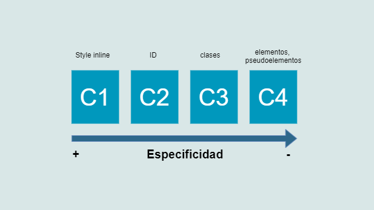

Como su propio nombre indica, el CSS (Cascading Style Sheets) es un lenguaje que funciona con el concepto de "cascada". El concepto de cascada implica que **el orden de las reglas en CSS es importante**. Cuando dos reglas tienen la misma especificidad, se aplica la que se ha definido en último lugar (o más abajo, podríamos decir). Pero, ¿qué es la especificidad?

## La especificidad

La especificidad en CSS **es la forma que tienen los navegadores para calcular qué reglas se deben aplicar a los elementos**. Puedes pensar en ella como en un "peso" o "valor" que se determina según el tipo de selector.

Seguro que alguna vez te has encontrado un caso en el que tienes más de una regla definida para un mismo elemento, y sin embargo la última regla definida no es la que el navegador está interpretando. Esto es debido a que has definido alguna otra regla en un selector con más especificidad que este. Vamos a ver entonces, qué tipos de selectores existen y qué especificidad asociada tienen.

### Tipos de selectores

En la siguiente lista se muestran los distintos tipos de selectores ordenados **de menor a mayor** especificidad:

1. **Selectores de tipo:** Los selectores de tipo son aquellos que seleccionan los elementos por el nombre del nodo (`a`, `span`, `p`, `body`, ...)
2. **Selectores de clase:** Los selectores de clase son aquellos que seleccionan los elementos basados en su atributo `class`.
3. **Selectores de ID:** Los selectores de ID son aquellos que seleccionan los elementos basados en su atributo `id`.

Algunos ejemplos:

```css
/*Selectores de tipo*/
a{
    display: block:
}
body {
    background: white;
}
/*Selectores de clase*/
.myClass {
    padding: 1rem 2rem;
}
[class~=myClass] {
    padding: 1rem 2rem;
}

/*Selectores de ID*/
#myId {
    padding: 1rem 2rem;
}
[id~=myId] {
    padding: 1rem 2rem;
}
```

Seguramente habrás notado que existen otros selectores que no hemos mencionado, como son el selector universal (`*`), los selectores de herencia (`>`), siblings (`~`), etc. Estos no los hemos listado puesto que no tienen efecto sobre la especificidad.

Por otro lado, los llamados estilos *inline*, siempre sobreescriben a los estilos definidos en hojas de estilo externas, de modo que se puede considerar que tienen siempre mayor especificidad.

### Aviso "*important*"

La declaración `!important` sobreescribe cualquier otra declaración del mismo tipo que hayas definido. Puedes pensar en esta declaración como la que tiene mayor especificidad, aunque realmente lo que hace es saltarse las reglas de especificidad y machacarlas.

El uso de esta declaración está **totalmente desaconsejado**, puesto que puede dificultar mucho depurar los problemas con tu código, y la única forma de sobreescribir un `!important` es añadiendo otro dentro de un selector con más especificidad, o que aparezca después en el código...Lo cual terminaría convirtiendo tu CSS en algo realmente dificil de mantener. La regla es no hacer uso de ellos salvo para casos extremos como por ejemplo, sobreescribir estilos inline que te añada algún plugin externo, etc.

### Evitar los conflictos de especificidad

Existen varias formas de ayudar a evitar los conflictos de especificidad. Aquí van algunas de ellas:

* Evita el uso de `!important` en la medida de lo posible
* Evita los selectores semánticos (`article`, `header`, `footer`, `a`...) siempre que no sea para añadir estilos genéricos a toda tu aplicación:

```css
/*----MAL----*/
footer a{
    display: inline-block:
    padding: 4px 8px;
}
/*----BIEN----*/
.footer__link{
    display: inline-block:
    padding: 4px 8px;
}
```

* Utiliza el mínimo número de selectores posibles para estilar un elemento. Puedes apoyarte en metodologías como BEM para facilitar la nomenclatura y reducir el número de anidaciones:

```css
/*----MAL----*/
nav li a{
    display: inline-block:
    padding: 4px 8px;
}
/*----BIEN----*/
.navbar__link{
    display: inline-block:
    padding: 4px 8px;
}
```

### Cómo se calcula internamente el peso o valor de los selectores

Hasta ahora hemos hablado de qué selectores tienen más o menos especificidad, pero no te he explicado cómo el navegador calcula realmente dichos valores o pesos de cada uno de ellos.

La verdad es que puedes tener una muy buena base y no encontrarte problemas en tus maquetas sin necesidad de conocer esta parte (yo lo hice durante años). De todos modos, si tienes curiosidad y quieres entrar en más detalle, continúa leyendo🤓.

El peso de la especificidad de un selector se mide utilizando cuatro valores dividios en cuatro respectivas columnas: `[C1,C2,C3,C4]`.

Cada una de estas columnas está relacionada con unos tipos de selectores, y se suman puntos en cada una de ellas en función de dichos selectores. Hay que tener en cuenta que el peso de las columnas va de mayor a menor, de izquierda a derecha:



* **C1:** Es la columna con más peso. Se suma un punto si la declaración está en un "style inline" (1,0,0,0)
* **C2:** Segunda columna con más peso. Se suma un punto por cada selector con ID (0,1,0,0)
* **C3:** Tercera columna con más peso. Se suma un punto por cada selector de clase (0,0,1,0)
* **C4:** Columna con menos peso. Se suma un punto por cada selector o pseudoelemento (0,0,0,1)

Si todavía quieres saber más, te dejo un par de enlaces más "gráficos" que seguro te serán de utilidad:

* Aquí tienes una [calculadora de especificidad](https://specificity.keegan.st/) online interactiva, creado por \[Keegan Street].
* Y este detallado [artículo](https://devopedia.org/css-specificity) sobre los cálculos relativos a la especificidad con tablas e imágenes para facilitar la comprensión.