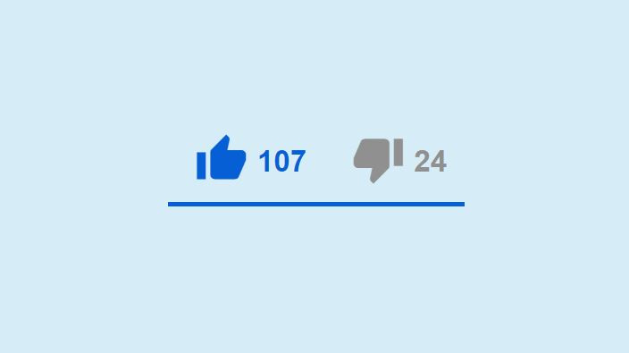

## Introducción

En el [artículo anterior](https://samutorres.com/blog/react-hooks-de-usestate-a-usereducer) explicamos las bases del Hook `useReducer`. Si todavía no lo has leído, te invito a hacerlo, puesto que te ayudará a seguir lo que vamos a desarrollar a continuación.

En este artículo vamos a implementar por fin la funcionalidad del componente de "likes/dislikes" para que reproduzca el comportamiento del que tiene Youtube en sus vídeos. A pesar de que en el último artículo ya hicimos una primera aproximación, vamos a empezar de nuevo de cero para refrescar conocimientos y comprender el flujo completo.

Partimos con el siguiente esqueleto:

```jsx
import React from "react";

function SocialCount() {
  return (
    <div>
      <button> LIKES | 0 </button>
      <button> DISLIKES | 0 </button>
    </div>
 );
}

export default SocialCount;
```

Se trata de un componente al que llamamos `SocialCount` y que está definido como una función. De momento solo devuelve el HTML que contiene los botones de like y dislike, con el valor cero.

Antes de comenzar, vamos a refrescar las acciones y comportamiento esperado de nuestro componente. Le he puesto nombres a las acciones (en negrita), puesto que serán los identificadores de dichas acciones que usaremos en la función reductora:

* El usuario pulsa sobre el botón de like:

  * **\[LIKE]** Si no hay nada pulsado todavía: `likes + 1`
  * **\[UNLIKE]** El botón de like ya ha sido pulsado: `likes - 1`
  * **\[TOGGLE]** El botón dislike ya ha sido pulsado: `likes + 1` y `dislikes - 1`
* El usuario pulsa sobre el botón de dislike:

  * **\[DISLIKE]** Si no hay nada pulsado todavía: `dislikes + 1`
  * **\[UNDISLIKE]** El botón de dislike ya ha sido pulsado: `dislikes - 1`
  * **\[TOGGLE]** El botón like ya ha sido pulsado: `dislikes + 1` y `likes - 1`

Ahora que ya tenemos las acciones de nuestro componente identificadas (un total de 5 diferentes), vamos a definirlas en nuestro código.

## Definiendo las acciones disponibles

Es una buena práctica tener definidas las acciones como claves dentro de un objeto, en este caso `actions`, para facilitar así su mantenimiento y uso.

En primer lugar definimos las acciones de la siguiente forma:

```javascript
const actions = {
  like: "LIKE",
  unlike: "UNLIKE",
  dislike: "DISLIKE",
  undislike: "UNDISLIKE",
  toggle: "TOGGLE"
};
```

## Estado inicial del componente

El componente necesita un estado inicial, que será la información inicial que contenga y sobre la cual trabajará. 

Para el caso de nuestro componente de likes/dislikes, necesitamos saber la siguiente información:

* Estado del contador de likes (`likes`)
* Estado del contador de dislikes (`dislikes`)
* ¿Está pulsado el botón de like? (`isLiked`)
* ¿Está pulsado el botón de dislike? (`isDisliked`) 

Necesitamos por lo tanto, 4 entradas en nuestro objeto de estado, el cual definimos de la siguiente forma:

```javascript
const initialState = {
  likes: 107,
  dislikes: 24,
  isLiked: false,
  isDisliked: false
};
```

En una aplicación real, estos estados podríamos recibirlos como resultado de, por ejemplo, una llamada AJAX, pero para el propósito de este artículo hemos omitido esta parte y definido un estado inicial cualquiera.

## Creando la función reductora

La función reductora se encargará de recibir el estado actual (`state`) y una acción (`action`). Dicha acción determinará qué nuevo estado nos devolverá la función reductora.

La premisa principal al crear una función reductora, es que debemos crear una condición (es decir, una nueva instancia `case` dentro de la declaración `switch`) para cada una de las acciones definidas. Vamos a ello:

```javascript
function socialReducer(state, action) {

  const { likes, dislikes, isLiked, isDisliked } = state;

  switch (action.type) {
    //Se pulsa el botón like sin estar previamente pulsado
    case "LIKE":
      return {
        ...state,
        likes: likes + 1,
        isLiked: !isLiked
      };
    //Se pulsa el botón like estando previamente pulsado
    case "UNLIKE":
      return {
        ...state,
        likes: likes - 1,
        isLiked: !isLiked
      };
    //Se pulsa el botón dislike sin estar previamente pulsado
    case "DISLIKE":
      return {
        ...state,
        dislikes: dislikes + 1,
        isDisliked: !isDisliked
      };
    //Se pulsa el botón dislike estando previamente pulsado
    case "UNDISLIKE":
      return {
        ...state,
        dislikes: dislikes - 1,
        isDisliked: !isDisliked
      };
    //Se pulsa cualquiera de los dos, estando el otro previamente pulsado
    case "TOGGLE":
      return {
        ...state,
        isLiked: !isLiked,
        isDisliked: !isDisliked,
        likes: isLiked ? likes - 1 : likes + 1,
        dislikes: isDisliked ? dislikes - 1 : dislikes + 1
      };
    default:
      return state;
  }
}
```

Mucho que procesar, ¿verdad?

Si prestas atención, verás que no es para tanto. Esto no es más que una traducción de las acciones que habíamos descrito en la introducción de este artículo pero pasadas a una declaración condicional `switch`. Vamos paso por paso.

En primer lugar, hemos usado la [desestructuración de objetos](https://developer.mozilla.org/es/docs/Web/JavaScript/Reference/Operators/Destructuring_assignment#desestructuraci%C3%B3n_de_objetos) para extraer los valores de `state`:

```javascript
const { likes, dislikes, isLiked, isDisliked } = state;
```

A continuación creamos una declaración `switch`, donde cada entrada se corresponde al tipo de acción recibida:

```javascript
function socialReducer(state, action) {

  const { likes, dislikes, isLiked, isDisliked } = state;
  // highlight-start


  switch (action.type) {
  // highlight-end


    //Se pulsa el botón like sin estar previamente pulsado
    // highlight-start

    case "LIKE":
    // highlight-end

      return {
        ...state,
        likes: likes + 1,
        isLiked: !isLiked
      };

  ...

}
```

Vamos a utilizar la primera condición para explicarlo al detalle. El resto de condiciones funcionan igual.

* En primer lugar, es importante recordar que la función reductora **siempre debe devolver el nuevo estado**. Es por ello que dentro de cada `case` siempre tenemos un `return { ... }`
* Primero recogemos el valor del estado actual usando el [spread operator](https://developer.mozilla.org/es/docs/Web/JavaScript/Reference/Operators/Spread_syntax): `...state`.
* A continuación realizamos las modificaciones al valor afectado. En este caso aumentamos el contador de likes `likes: likes + 1`. Es exactamente lo mismo que habíamos definido en la introducción de este artículo. Puedes ir mirándola para comparar.
* Por último, necesitamos saber el estado del botón (si está activo o no). Lo que hacemos es que, cada vez que se pulsa, invertimos su estado actual negándolo: `isLiked: !isLiked`

Para el resto de acciones funciona de la misma forma. Devolvemos un nuevo estado recuperando el anterior y modificando lo necesario según el tipo de acción recibida.

Tómate tu tiempo para analizar cada caso y verás que no tiene mayor complicación.

Ahora que ya tenemos la función reductora definida, podemos crear el estado de nuestro componente utilizando el Hook `useReducer`.

## Definiendo el estado con useReducer

El Hook `useReducer` **nos permite añadir estado a nuestro componente** y hacer uso de la función reductora que hemos creado anteriormente.

Para hacer uso del mismo, nos dirigimos a la raiz de nuestro componente `socialCount` y lo declaramos de la siguiente forma:

```jsx
...
function SocialCount() {
  // highlight-start

  const [state, dispatch] = useReducer(socialReducer, initialState);
  // highlight-end


  const { likes, dislikes, isLiked, isDisliked } = state;
  
  return (
    <div>
      <button>LIKES | 0 </button>
      <button>DISLIKES | 0 </button>
    </div>
  );
}

export default SocialCount;
```

Este Hook recibe dos parámetros:

* El nombre de nuestra función reductora: `socialReducer`
* El estado inicial de nuestro componente: `initialState`

Y nos devuelve lo necesario para poder manejar el estado de nuestro componente:

* El estado: `state`
* El método que nos proporciona para poder enviar acciones a la función reductora: `dispatch`

Ahora que ya podemos acceder al estado, vamos a cambiar los valores "cero" de los botones por los del estado utilizando las variables \`likes\` y \`dislikes\`:

```jsx
...
<button> LIKES | {likes} </button>
<button> DISLIKES | {dislikes} </button>
...
```

> Recuerda que podemos acceder directamente a \`likes\` y \`dislikes\` puesto que en el componente hacemos uso de la desestructuración de objetos \` const { likes, dislikes, isLiked, isDisliked } = state;\`

## Recapitulando

Ahora ya tenemos lo siguiente:

* Hemos definido las acciones posibles
* Hemos definido el estado inicial
* Hemos creado la función reductora que recibirá una acción para modificar el estado
* Le hemos dado la posibilidad de usar el estado al componente mediante la declaración de `useReducer`
* Tenemos un componente `SocialCount` que "pinta" dos botones (like/dislike) con su propio contador

Puedes pegarle un vistazo al código en el siguiente sandbox:

https://codesandbox.io/s/social-buttons-v55-forked-3e5n0?file=/src/components/SocialCount.js?view=split&autoresize=1&fontsize=12&hidenavigation=1&module=%2Fsrc%2Fcomponents%2FSocialCount.js&theme=dark

A continuación, vamos a controlar los eventos para que la función reductora reciba las acciones.

## Manejando los eventos

Necesitamos ahora una función que controle qué sucede cuando el usuario pulsa sobre el botón de like y otra para el botón de dislike. Estas funciones serán las encargadas de enviar las acciones a la función reductora mediante el método `dispatch` que nos ofrece el Hook `useReducer`.

Comencemos por definir la función que controlará el evento de pulsar el botón like. 

Dentro del cuerpo de nuestro componente, definimos lo siguiente:

```jsx
  const handleLikeClick = () => {
    if (!isDisliked) {
      isLiked
        ? dispatch({ type: actions.unlike })
        : dispatch({ type: actions.like });
    } else {
      dispatch({ type: actions.toggle });
    }
  };
```

¿Qué hace el código anterior? Vamos a traducirlo al lenguaje humano:

* Si pulsas el botón de like cuando ya estaba activo, realizas la acción "UNLIKE", es decir, lo desactivas.
* Si pulsas el botón de like cuando todavía no está activo, realizas la acción "LIKE", es decir, lo activas.
* Si pulsas el botón like cuando el de dislike está activo, se intercambian sus estados mediante la acción "TOGGLE"

> Todas las acciones se envían a la función reductora mediante el método `dispatch({type: 'ACTION_NAME'})`, donde accedemos al nombre de la acción desde el objeto `actions` que definimos al principio de este artículo

A continuación, haríamos lo mismo para definir la función que controlará el pulsado del botón de dislike:

```jsx
  const handleDislikeClick = () => {
    if (!isLiked) {
      isDisliked
        ? dispatch({ type: actions.undislike })
        : dispatch({ type: actions.dislike });
    } else {
      dispatch({ type: actions.toggle });
    }
  };
```

Una vez definidas ambas funciones, solo faltaría definirlas como event handlers de sus respectivos botones. Para ello recurrimos al atributo `onClick`:

```jsx
...
<button onClick={handleLikeClick}> LIKES | {likes} </button>
<button onClick={handleDislikeClick}> DISLIKES | {dislikes} </button>
...
```

Y... ¡voilà!

Ahora ya podemos hacer clic sobre nuestros botones de like y dislike, los cuales ejecutarán sus respectivos controladores de eventos. Estos últimos son los encargados de "despachar" las acciones hacia la función reductora, que modificará el estado y lo actualizará en todo nuestro componente.

A continuación tienes el resultado final del componente. Me he permitido añadirle un poco de CSS para que se parezca al de Youtube.

https://codesandbox.io/s/social-buttons-v6-go2jt?file=/src/components/SocialCount.js?file=/src/components/SocialCount.js?view=split&autoresize=1&fontsize=12&hidenavigation=1&module=%2Fsrc%2Fcomponents%2FSocialCount.js&theme=dark