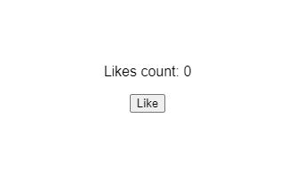
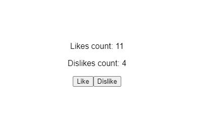

*Foto por [Grant Durr](https://unsplash.com/@blizzard88) en Unsplash*

Los [Hooks](https://es.reactjs.org/docs/hooks-intro.html) se incorporaron a React en la versión 16.8. Hasta la llegada de los mismos, si querías manejar el estado u otras características de un componente de tu aplicación estabas obligado a utilizar componentes de clase. Ahora esto ha cambiado y podemos hacer uso del estado de componentes definidos como funciones, lo cual simplifica mucho trabajar con los mismos.

En este primer artículo de la serie que tengo prevista sobre Hooks en React, hablaremos del Hook de estado o `useState()`, pero vamos por orden. 

En primer lugar... ¿Qué es un Hook?

## Qué es un Hook

Los Hooks son funciones que te permiten hacer uso de características de React que te ayudan a resolver una variedad de problemas que se han ido detectando a lo largo de los años durante el uso de dicha librería.

Entre otras cosas, te ayudan a **controlar el estado de tus componentes** sin necesidad de usar clases y **simplifican la complejidad de los mismos**.

> Si te interesa saber más sobre la motivación y la necesidad de la creación de los Hooks, en [este enlace](https://es.reactjs.org/docs/hooks-intro.html#motivation) tienes una justificación escrita por el propio equipo de React.

## El Hook de estado

En el momento en el que estás desarrollando un componente de función y surge la necesidad de añadirle un estado, es el momento de utilizar la función `useState()`. De cara a facilitar la comprensión de este artículo vamos a trabajar con un ejemplo que nos va a servir a lo largo del mismo.

Crearemos un componente "social" que va a consistir en un contador de "likes/dislikes". Para este primer artículo, únicamente implementaremos ambos botones y les agregaremos control de estado utilizando `useState()`. En próximos artículos lo iremos mejorando haciendo uso de otros Hooks como `useReducer()` y `useEffect()`.

> Puedes ver todo el código relativo a este artículo y jugar con él en el siguiente [codesandbox](https://codesandbox.io/s/wandering-cloud-c4cbn?file=/src/components/LikeButton.js:0-275).

Nuestro componente inicial luce así:

```javascript
import React from "react";

function SocialCount() {
  return (
    <div>
      <p>Likes count:</p>
      <button>Like</button>
    </div>
  );
}

export default SocialCount;
```

Simplemente se trata de un componente que renderiza un botón y un texto que pretende mostrar el recuento total de likes. En este punto detectamos que debemos añadirle un estado para controlar dicho recuento. Para ello recurriremos a `useState()`, que se importa de la siguiente forma:

```javascript
import React, { useState } from 'react';
```

Ahora que ya podemos hacer uso del mismo, en el cuerpo de nuestra función vamos a definir el estado de la siguiente forma:

```javascript
import React, { useState } from 'react';

function SocialCount() {
 
  const [ likes, setLikes ] = useState(0); // highlight-line
  
  return (
    <div>
      <p>Likes count:</p>
      <button>Like</button>
    </div>
  );
}

export default SocialCount;
```

Esta definición agrega estado al componente y lo hace iniciándolo con el valor de cero. 

La función `useState()` devuelve dos valores, los cuales se corresponden a `likes` y `setLikes` (el nombre podría haber sido cualquier otro). Este tipo de asignaciones se conocen como **asignación de desestructuración**, y si no estás familiarizad@ con ellas, te aconsejo echar un vistazo [aquí](https://developer.mozilla.org/es/docs/Web/JavaScript/Reference/Operators/Destructuring_assignment#descripci%C3%B3n).

A `useState()` se le pasa como argumento el estado inicial, que se corresponde con la variable `likes` y que en este caso hemos definido a cero. 

La variable `setLikes` se asigna a una función que utilizaremos para modificar el estado, es decir, cada vez que queramos cambiar el valor de `likes`, tendremos que hacer uso de la función `setLikes`.

### Mostrando el valor del estado

Ahora vamos a probar a pintar por pantalla el valor de nuestro contador de likes. Para ello, simplemente podemos añadir la variable en el template que retorna nuestro componente:

```javascript
import React, { useState } from 'react';

function SocialCount() {
  
  const [ likes, setLikes ] = useState(0); 
  
  return (
    <div>
      <p>Likes count: {likes}</p> // highlight-line
      
      <button>Like</button>
    </div>
  );
}

export default SocialCount;
```

En esta situación, el contador mostrará el valor cero, puesto que así lo hemos definido en el `useState(0)`. Además, nuestro botón todavía no es funcional, así que por mucho que pulsemos sobre el mismo, no cambiará su valor. Por lo tanto, nuestro componente pintaría lo siguiente:



### Manejo de eventos

Vamos ahora a modificar el estado de nuestro componente. 

Haciendo uso del atributo `onClick`, le añadimos al botón una función que debe ejecutar la modificación del estado. 

¿A quién hemos dicho antes que hay que llamar para modificar al estado? Exacto, a `setLikes`:

```javascript
<button onClick={() => setLikes(likes + 1)}>Like</button>
```

> Cuidado: Los controladores de eventos o "event handlers" son funciones o referencias a funciones, es por ello que no llamamos directamente a `setLikes()`, sino que lo hacemos dentro de una función de flecha (`onClick={() => ...}`)

Lo que hace el código anterior es que cada vez que se pulse el botón, se ejecutará la función que modifica el estado (`setLikes`), a la cual **le pasamos como parámetro el valor del nuevo estado**, que en este caso sería el resultado de sumarle 1 al valor actual (`likes + 1`).

Nuestro componente ahora pasaría a tener el siguiente contenido:

```javascript
import React, { useState } from "react";

function SocialCount() {
  
  const [likes, setLikes] = useState(0);
  
  return (
    <div>
      <p>Likes count: {likes}</p>
      <button onClick={() => setLikes(likes + 1)}>Like</button> // highlight-line
    
    </div>
  );
}

export default SocialCount;
```

### Manejar más de un estado

¿Qué pasaría ahora si quisiéramos añadir también un botón de dislikes y su recuento total? Pues la solución es simple, añadimos un nuevo `useState()` para los dislikes tal y como hemos hecho anteriormente con los likes:

```javascript
const [dislikes, setDislikes] = useState(0);
```

Ahora tenemos definida una nueva variable que guardará este nuevo estado (`dislikes`), también inicializado a cero, y podremos modificarlo de nuevo utilizando un controlador de eventos en un nuevo botón que vamos a crear para añadir los dislikes. Con lo cual nuestro código quedaría así:

Con lo cual nuestro código quedaría así:

```javascript
import React, { useState } from "react";

function SocialCount() {
  
  const [likes, setLikes] = useState(0);
  const [dislikes, setDislikes] = useState(0); // highlight-line
  
  return (
    <div>
      <p>Likes count: {likes}</p>
      <p>Dislikes count: {dislikes}</p> // highlight-line
      
      <button onClick={() => setLikes(likes + 1)}>Like</button>
      <button onClick={() => setDislikes(dislikes + 1)}>Dislike</button> // highlight-line
    
    </div>
  );
}

export default SocialCount;
```

Con esto ya tendríamos un componente muy básico capaz de manejar dos estados de forma independiente, controlando ambos contadores por separado. Nuestra aplicación pintaría algo así (ya... no le hemos puesto CSS):



### Para terminar

Obviamente este es un ejemplo muy simple y nuestro componente todavía no funciona como debería hacer un contador real de likes/dislikes. De hecho ahora mismo no es más que dos contadores independientes sin límite de interacción ni persistencia, pero cumple con el propósito de explicar cómo y para qué se utiliza el Hook de estado.

En próximos artículos iremos mejorando este componente para cumplir con las siguientes funcionalidades, mientras aprendemos nuevos Hooks:

* **Control de estado complejo**. Nos servirá para explicar el Hook `useReducer()`.
* **Persistencia**. Usaremos una de las múltiples aplicaciones del Hook `useEffect()`.